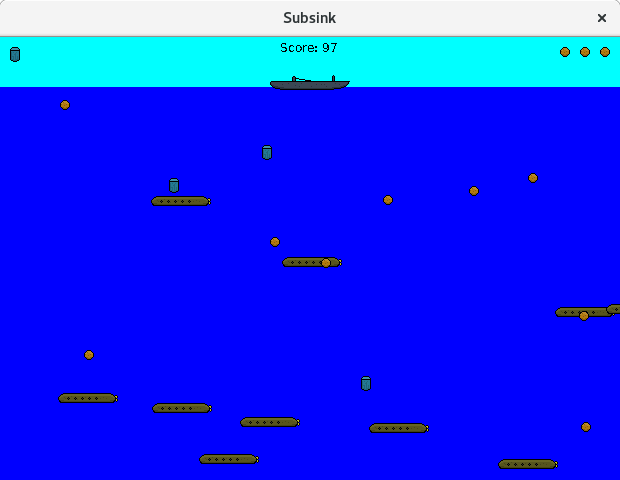

# SubSink

SubSink is a game where you play as a submarine destroyer, trying to destroy submarines and not letting them destroy you.

## Gameplay

Press the left or right arrows to accelerate left or right.
Press Z to drop a depth charge off your left side, and X to drop one off your right.
Your health is represented in the upper right corner and your charge stock in the left corner.
You have four charges, which replenish when an active charge either explodes or is lost to the depths.
The submarines will attack you with "height charges" (TODO I don't know if there's a better name for these??), so avoid them.

## Code Structure

This is a simple Swing app.
The `Main` class contains little besides a `World` - a `JPanel` which holds the game state.
Besides this and a simple `ImageLoader`, the rest of the classes are `Entity`s, agents and objects within the game.
Every 30ms, each entity is given an opportunity to respond to the presence of other entities and redraw itself on the board.
